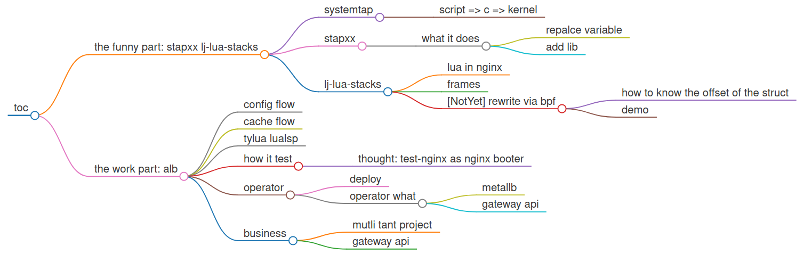
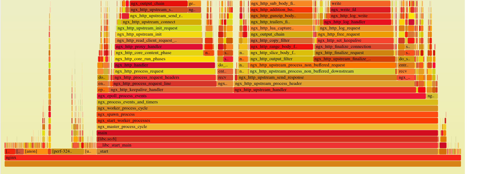
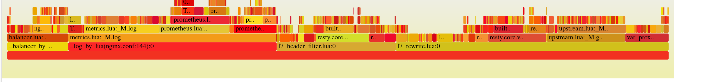
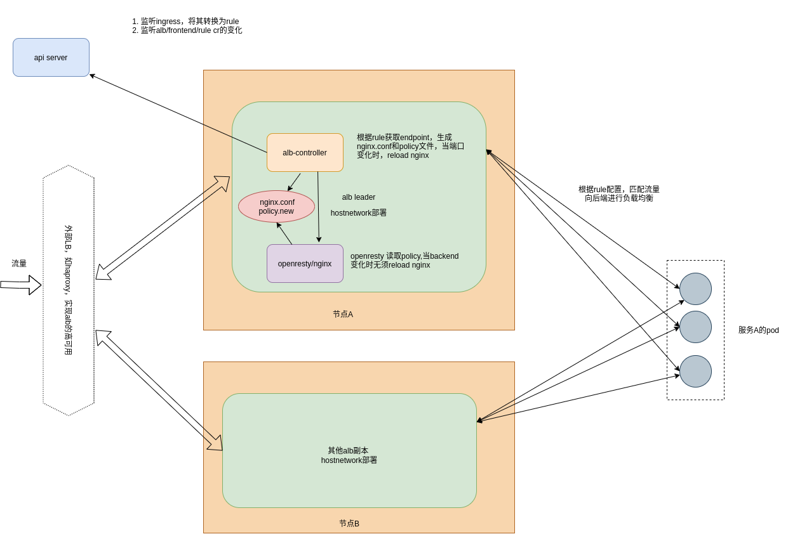
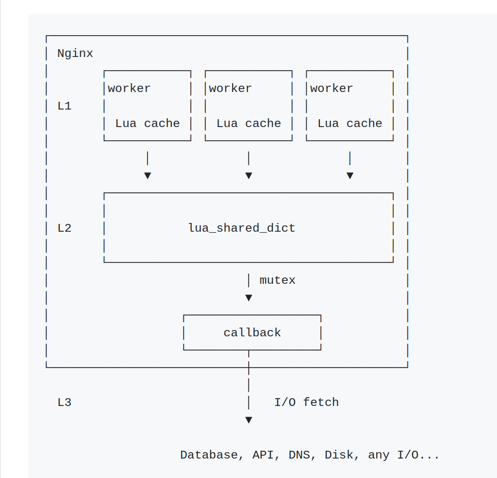
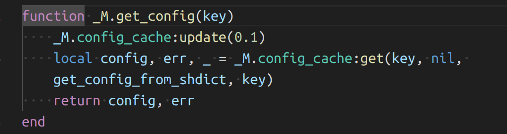
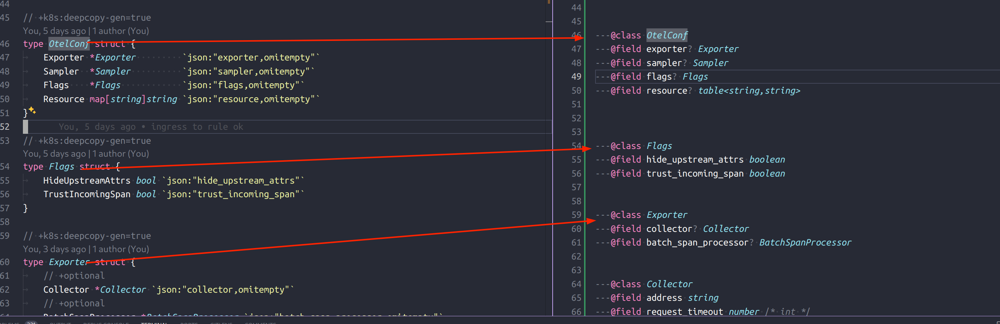
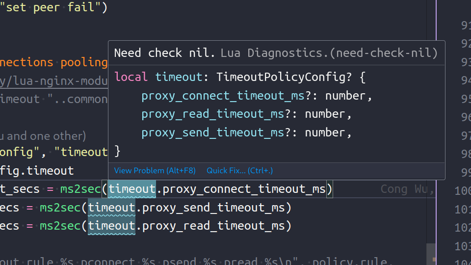
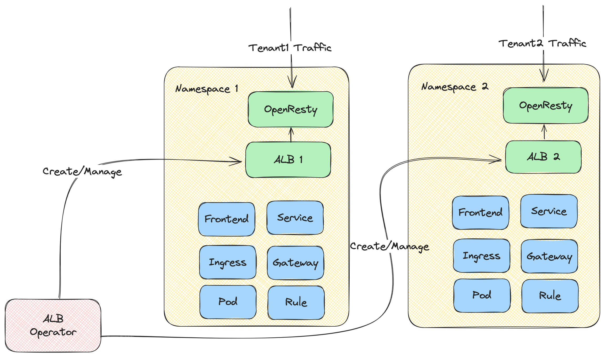

<!-- header: introduce -->
# hello
- who am i
- links
    - alb: https://github.com/alauda/alb.git
    - this slide: https://github.com/woodgear/share/tree/master/240803-ngshark

---
<!-- header: toc -->
#  lj-lua-stacks && openresty in k8s

<!-- ```markmap
- toc
    - the funny part: stapxx lj-lua-stacks
        - systemtap
            - script => c => kernel
        - stapxx
            - what it does
                - repalce variable
                - add lib
        - lj-lua-stacks
            - lua in nginx
            - frames
            - [NotYet] rewrite via bpf
                - how to know the offset of the struct
                - demo
    - the work part: alb
        - config flow
        - cache flow
        - tylua lualsp
        - how it test
             - thought: test-nginx as nginx booter
        - operator
            - deploy
            - operator what
                - metallb
                - gateway api
        - business
            - mutli tant project
            - gateway api
``` -->

---
<!-- header: p1: stapxx && lj-lua-stacks -->



---
<!-- header: p1: stapxx && lj-lua-stacks -->
# what is systemtap
```stap
index = @var("ngx_http_module", "/xxx/nginx")->index
```
```c
struct ngx_module_s {
    ngx_uint_t            ctx_index;
    ngx_uint_t            index;
    char                 *name;
```
```c
l->__retvalue = uderef(8, ((((((int64_t) (/* pragma:vma */ (
{
 unsigned long addr = 0; 
 addr = _stp_umodule_relocate ("/usr/local/openresty/nginx/sbin/nginx", 0x2704e0, current);
 addr;
}
))))) + (((int64_t)8LL)))));

```
---

<!-- header: p1: stapxx && lj-lua-stacks -->
# what is stapxx
stapxx: https://github.com/openresty/stapxx
```stapxx
index = @var("ngx_http_module", "$^exe_path")->index
 V
index = @var("ngx_http_module", "/xxx/nginx")->index
```
```bash
  sudo stap \
    -k \ -x $NG_PID \
    -d $target/nginx/sbin/nginx \
    -d $target/luajit/lib/libluajit-5.1.so.2.1.0 \
    -d /usr/lib/ld-linux-x86-64.so.2 \
    ... 省略
    ./all-in-one.stap
```

---
<!-- header: p1: stapxx && lj-lua-stacks -->
tips: 
```bash
#alb2/scripts/alb-perf-actions.sh
function alb-perf-docker() (
  local worker_id=$(_apd_find_ng_worker_pid_in_docker $container_name)
  local root=$(_alb_perf_find_container_root $container_name) # docker inspect $1 | jq '.[0].GraphDriver.Data.MergedDir'
  alb-flame-stap-lua $perf_case $worker_id "$((perf_time - 20))" "$root" &
)
function alb-flame-stap-lua() (
  local key=$1 local pid=$2 local time=${3-"120"} local root=${4-""}
  local flag="--sysroot $root"  #  <-------- 指定root
  eval "sudo $STAPXX_BASE/stap++ $flag $STAPXX_BASE/samples/lj-lua-stacks.sxx --skip-badvars -x $pid --arg time=$time >$key.bt"
)
```
```c
# systemtap session.cxx#1177
    // wg:不要更新 build_tree
    //    kernel_build_tree = sysroot + "/lib/modules/" + kernel_release  + "/build";
```


---
<!-- header: p1: stapxx && lj-lua-stacks -->
# nginx and openresty and luajit


---
<!-- header: p1: stapxx && lj-lua-stacks -->
iter in frames && get chunkname(lua file name) and line


---
```stap
function luajit_debug_dumpstack(L, T, depth, base, simple)
    bot = $*L->stack->ptr64 + @sizeof_TValue //@LJ_FR2
    for (nextframe = frame = base - @sizeof_TValue; frame > bot; ) {
        if (@frame_gc(frame) == L) { tmp_level++ }
        if (tmp_level-- == 0) {
            size = (nextframe - frame) / @sizeof_TValue
            found_frame = 1
            break
        }
        nextframe = frame
        if (@frame_islua(frame)) {
            frame = @frame_prevl(frame)
        } else {
            if (@frame_isvarg(frame)) { tmp_level++;}
            frame = @frame_prevd(frame); } 
        }

    if (!found_frame) { frame = 0 size = tmp_level }
    if (frame) {
        nextframe = size ? frame + size * @sizeof_TValue : 0
        fn = luajit_frame_func(frame)
        if (@isluafunc(fn)) {
            pt = @funcproto(fn)
            line = luajit_debug_frameline(L, T, fn, pt, nextframe)
            name = luajit_proto_chunkname(pt)  /* GCstr *name */
            path = luajit_unbox_gcstr(name)
            bt .= sprintf("%s:%d\n", path, line)
        } 
    } else if (dir == 1) { break } else { level -= size }
```


---

<!-- header: p1: stapxx && lj-lua-stacks/ngshark -->
# in 2024: why not rewrite in ebpf? 
build block
- perf event on user process => ebpf
- know field offset in memory => pahole + dwarf parser
--- 
<!-- header: p1: stapxx && lj-lua-stacks/ngshark -->
# pahole
自己手写dwarf解析器很麻烦，但是我们有pahole。
```bash
pahole --compile -C GCobj,GG_State,lua_State,global_State $OPENRESTY_BUILD_TRARGRT_DIR/luajit/lib/libluajit-5.1.so.2.1.0 >$out
sed -i '/.*typedef.*__uint64_t.*/d' $out
sed -i '/.*typedef.*__int64_t.*/d' $out
sed -i 's/Node/LJNode/g' $out
```
```c
struct global_State {
	lua_Alloc                  allocf;               /*     0     8 */
	void *                     allocd;               /*     8     8 */
	GCState                    gc;                   /*    16   104 */
	/* --- cacheline 1 boundary (64 bytes) was 56 bytes ago --- */
	GCstr                      strempty;             /*   120    24 */
	/* --- cacheline 2 boundary (128 bytes) was 16 bytes ago --- */
	uint8_t                    stremptyz;            /*   144     1 */
    // ... 省略
}
```

---
<!-- header: p1: stapxx && lj-lua-stacks/ngshark -->
# ngshark(NOT YET)
```c
#define READ_SRTUCT(ret, ret_t, p, type, access)            \
    do {                                                \
        type val;                                   \
        bpf_probe_read_user(&val, sizeof(type), p); \
        ret = (ret_t)((val)access);                 \
    } while (0)
void *GLP = (void *)0x7cc2e558c380; // TODO
void *luajit_G(){
    void *ret;
    READ_SRTUCT(ret, void *, GLP, lua_State, .glref.ptr64);
    return ret;
}
void *luajit_cur_thread(void *g){
    void *gco;
    size_t offset = offsetof(struct global_State, cur_L);
    READ_SRTUCT(gco, void *, g + offset, struct GCRef, .gcptr64);
    // gco is a union, th is lua_State and the point of th is gco itself
    // return &@cast(gco, "GCobj", "")->th
    return gco;
}
```
---
<!-- header: p2: alb -->
# alauda alb
<style>
img[alt~="center"] {
  display: block;
  margin: auto auto;
}
</style>


---

<!-- header: p2: alb/config-flow -->
## go part: config flow


--- 

<!-- header: p2: alb/cache-flow -->
## lua part: cache flow
policy.json => shdict => mlcache


--- 


<!-- header: p2: alb/luslsp-tylua -->

[lualsp](https://github.com/LuaLS/lua-language-server.git) [luau](https://luau-lang.org/syntax)
> Lua development just got a whole lot better 🧠 

## luslsp && tylua
 

--- 
<!-- header: p2: alb/luslsp-tylua -->
大道至简.jpg
```lua
local conf, err = cache.get_config(ref)
if err ~= nil then
    return nil
end
```


--- 
<!-- header: p2: alb/how-to-test/xx.t -->

thought: test-nginx as nginx booter

```perl
use t::Alauda;
our $tt = t::Alauda->get_test_name(__FILE__);
run_tests();
__DATA__
=== TEST 1: otel
--- mock_backend eval: "1880 $::tt"
--- init_worker_eval: require("mock_worker_init").init_worker()
--- lua_test_eval eval: "require('$::tt').test()"
```

---
<!-- header: p2: alb/how-to-test/xx.lua -->

```lua
local _M = {}
local h = require "test-helper"
local u = require "util"
local ph = require("policy_helper")

function _M.as_backend()
    ngx.say "ok"
end

function _M.test()
    ph.set_policy_lua({
        http = {tcp = {["80"] = {
            {rule = "1", internal_dsl = {{"STARTS_WITH", "URL", "/t1"}}, upstream = "u1"}}}
        },
        backend_group = {
            {name = "u1", mode = "http", backends = {{address = "127.0.0.1", port = 1880, weight = 100}}}
        } }
    )
    local res = h.assert_curl("http://127.0.0.1:80/t1")
    u.logs(res)
    h.assert_eq(res.body, "ok\n")
end
return _M
```
---
<!-- header: p2: alb/how-to-test/Alauda.pm -->
```perl
    if (defined  $block->lua_test_eval) {
        $lua_test_mode = "true";
        my $lua_test_eval=$block->lua_test_eval;
        $lua_test_full = <<__END;
server {
    listen 1999;
    location /t {
        content_by_lua_block {
            local test = function()
                $lua_test_eval
            end
            local ok,ret = pcall(test)
            if not ok then
                ngx.log(ngx.ERR," sth wrong "..tostring(ret).."  "..tostring(ok))
                ngx.print("fail")
                ngx.exit(ngx.ERROR)
            end
            ngx.print("ok")
        }
    }
}
...
    if (!defined $block->request) {
        $block->set_value("request","GET /t");
    }
```

--- 
<!-- header: p2: alb/the-operator -->
- deploy
- operator what
    - metallb
    - gateway api
--- 
<!-- header: p2: alb/others -->
- multi-tenancy project
- gateway api

---

QA


欢迎大家关注star提pr ^_^
https://github.com/alauda/alb.git